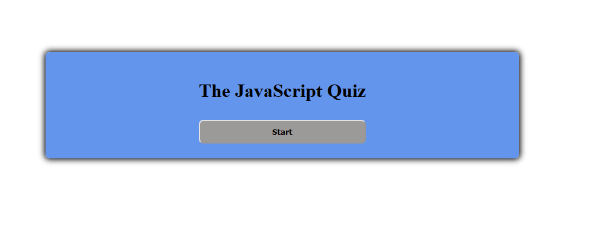
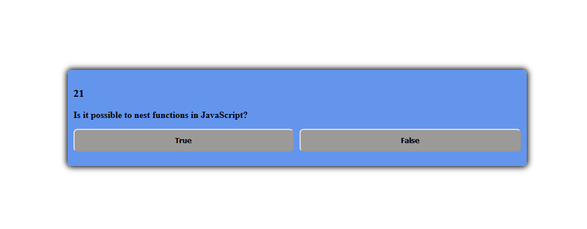
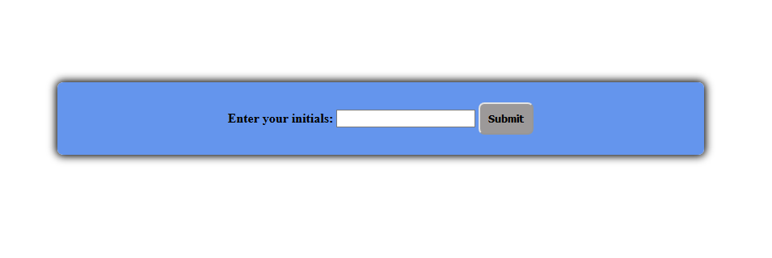

# 04-Web-APIs-Code-Quiz

# Created by Santiago Hincapie 

# Updated on 10/10/2020

# Link to web site

https://santiagohr2020.github.io/04-Web-APIs-Code-Quiz/

# Layout

The quiz app has a start page, question page, quiz taker initials page, and high score page. 

# Techonogies used

HTML5, CSS, and JavaScript

# Site Images

# Screenshot of the start page

# Screenshot of the quiz page

# Screenshot of the initail page

# Screenshot of the high score page

